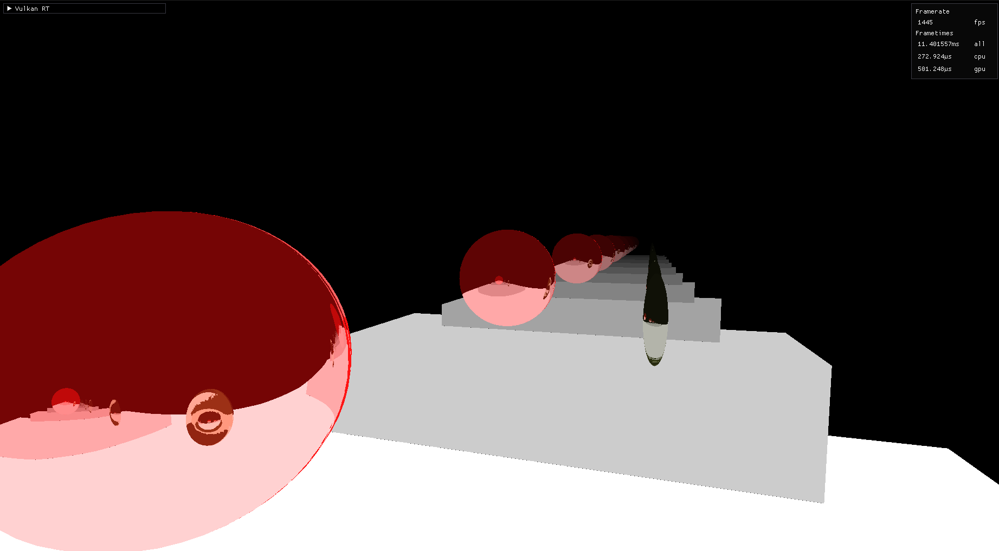
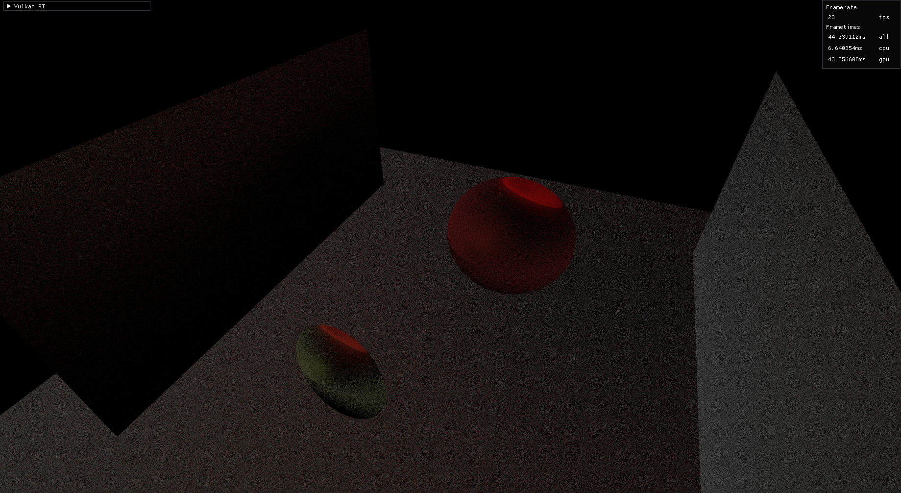
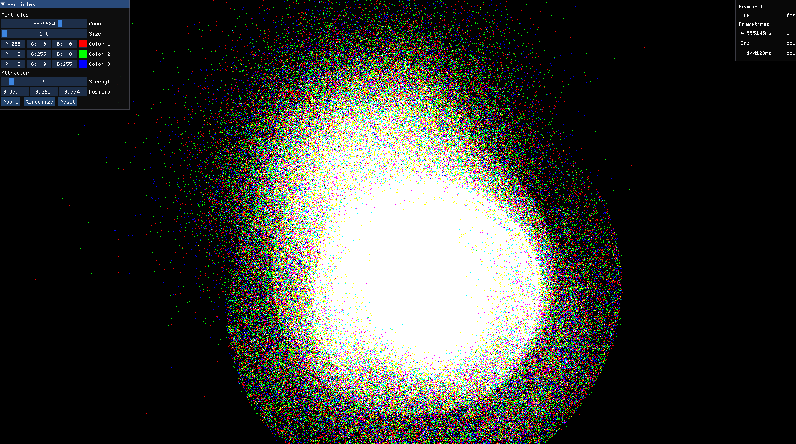
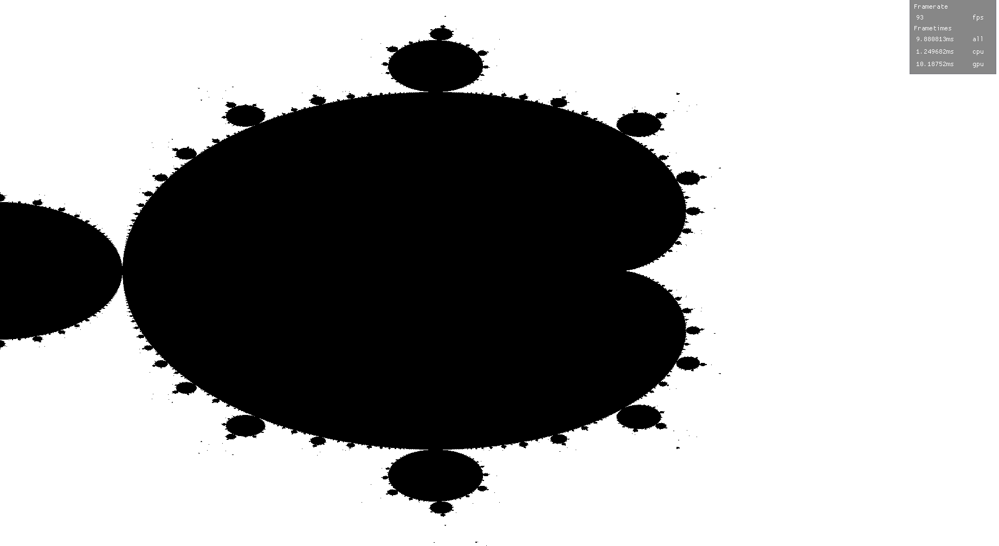

## Examples
|  |  |
-------------------------|-------------------------
**Raytracing Mirror** | **Global Ilumination**
`sh scripts/run.sh rt_mirror` | `sh scripts/run.sh rt_global_ilumination`
  |   
**GPU Particles**  | **Mandelbrot** 
`sh scripts/run.sh gpu_particles` | `sh scripts/run.sh mandelbrot`
  |  


## Install
### Dependecies

- Rust
- cmake
- pkg-config
- glslangValidator
- vulkan


### Installing Dependecies on Ubuntu LTS 20.04
- [Rust](https://www.rust-lang.org/tools/install)
```shell
curl --proto '=https' --tlsv1.2 -sSf https://sh.rustup.rs | sh
```
- cmake
```shell
sudo apt install cmake
```
- pkg-config
```shell
sudo apt install libfontconfig-dev
```
- glslangValidator
```shell
sudo apt-get install glslang-tools
```
- [Vulkan](https://vulkan.lunarg.com/doc/view/latest/linux/getting_started_ubuntu.html)
```shell
wget -qO - http://packages.lunarg.com/lunarg-signing-key-pub.asc | sudo apt-key add -
sudo wget -qO /etc/apt/sources.list.d/lunarg-vulkan-focal.list http://packages.lunarg.com/vulkan/lunarg-vulkan-focal.list
sudo apt update
sudo apt install vulkan-sdk
```


