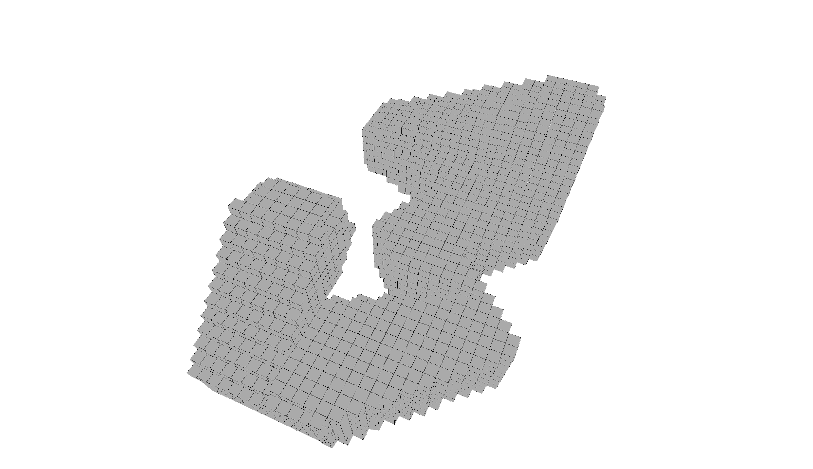
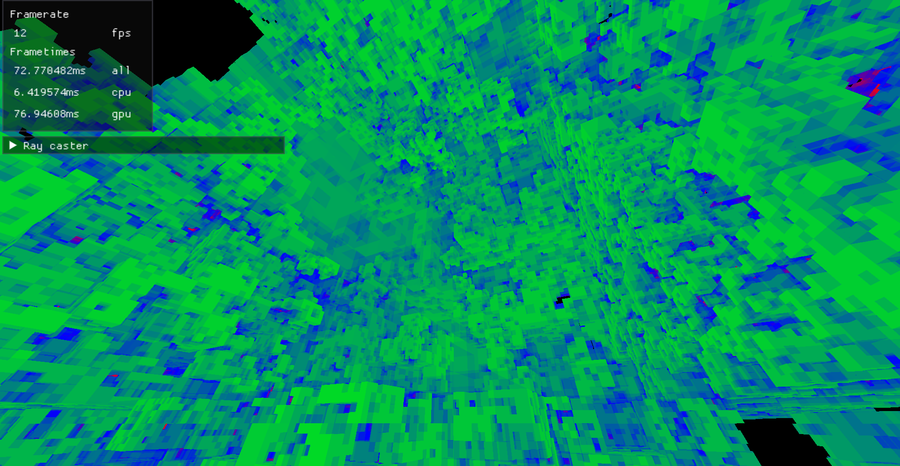
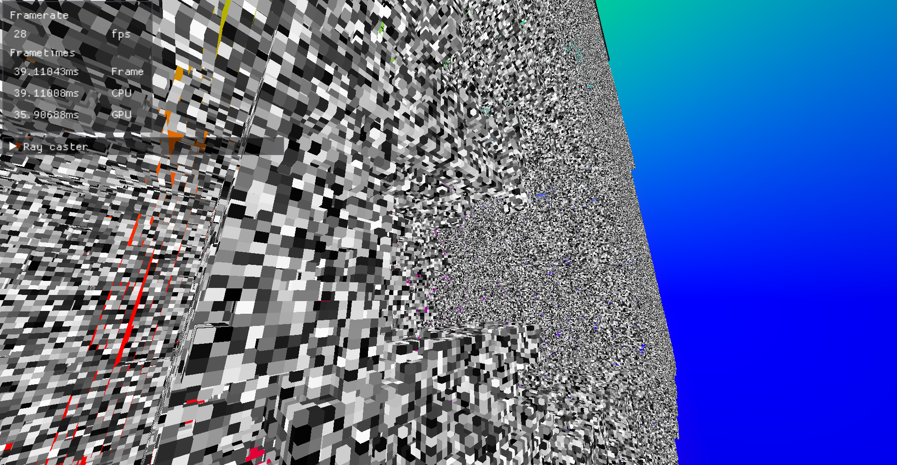
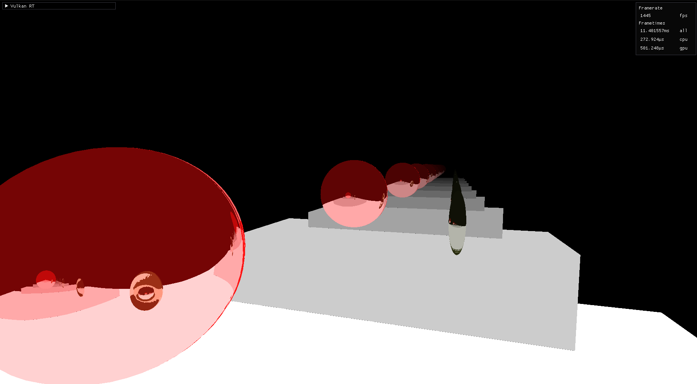
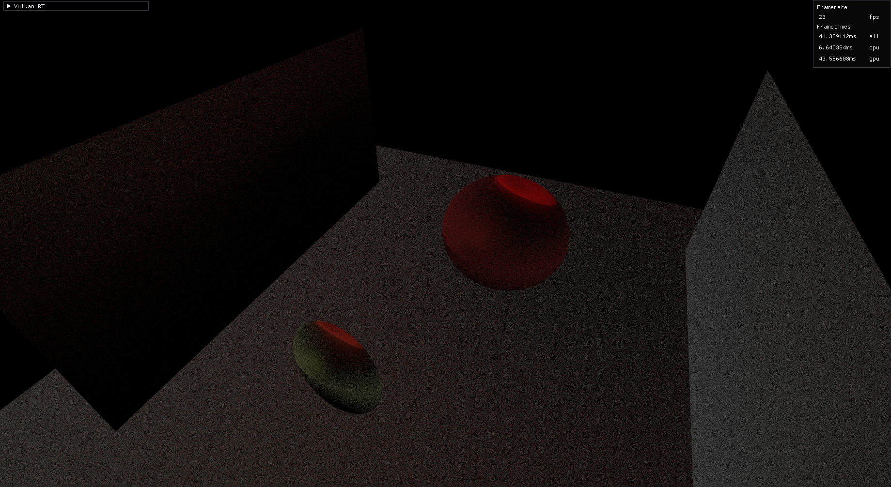
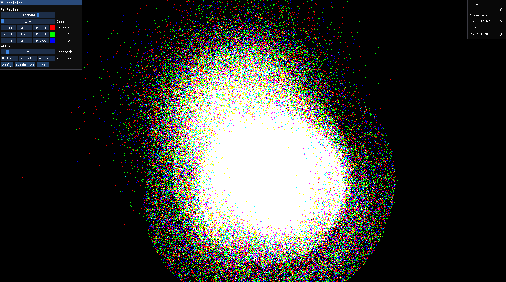

# Vulkan

A side repo where I try a bunch of different rendering technics and Ideas with vulkan in rust.


## Examples
|  |  |
-------------------------|-------------------------
**Space Ship Builder V3** | **Space Ship Builder V8**
`sh scripts/run.sh space_ship_builder_v3` | `sh scripts/run.sh space_ship_builder_v8`
 | 
**Dynamik Voxel loader and raycasting** | **Dynamik Voxel loader and raycasting V2**
`sh scripts/run_voxel_renderer.sh` | `sh scripts/run_voxel_renderer_v2.sh`
 | 
**Mirror scene with raytracing** | **Global ilumination scene raytracing**
`sh scripts/run.sh rt_mirror` | `sh scripts/run.sh rt_global_ilumination`
  |   
**Particle Simulation**  | **Mandelbrot Compute Shader** 
`sh scripts/run.sh gpu_particles` | `sh scripts/run.sh mandelbrot`
  |  

### Other
- `sh scripts/run.sh space_ship_builder_v2`
- `sh scripts/run.sh space_ship_builder`
- `sh scripts/run.sh rt_reflections`
- `sh scripts/run.sh rt_shadows`
- `sh scripts/run.sh comp_mandelbulb`
- `sh scripts/run.sh comp_mandelbrot`
- `sh scripts/run.sh rt-tringle`
- `sh scripts/run.sh triangle`


## Install
### Dependecies

- Rust
- cmake
- pkg-config
- glslangValidator
- vulkan
- hotspot  
*(for profiling)*
- cargo depgraph  
*(for showing dependecies)*


### Installing Dependecies on Ubuntu LTS 20.04
#### [Rust](https://www.rust-lang.org/tools/install)
```shell
curl --proto '=https' --tlsv1.2 -sSf https://sh.rustup.rs | sh
```
#### cmake
```bash
sudo apt install cmake
```
#### pkg-config
```bash
sudo apt install libfontconfig-dev
```
#### glslangValidator
```bash
sudo apt-get install glslang-tools
```
#### [Vulkan](https://vulkan.lunarg.com/doc/view/latest/linux/getting_started_ubuntu.html)
```bash
wget -qO - http://packages.lunarg.com/lunarg-signing-key-pub.asc | sudo apt-key add -
sudo wget -qO /etc/apt/sources.list.d/lunarg-vulkan-focal.list http://packages.lunarg.com/vulkan/lunarg-vulkan-focal.list
sudo apt update
sudo apt install vulkan-sdk
```


